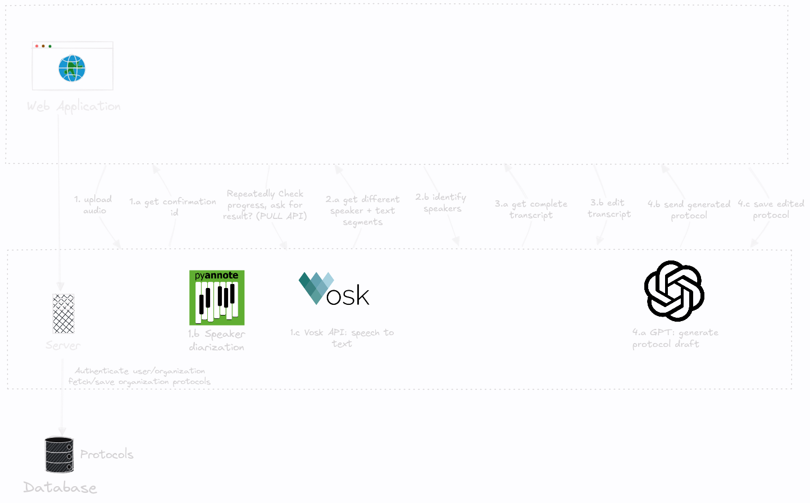

# ProtoGen Backend Server

## How does ProtoGen work?

The backend server uses mainly python with Flask web framework.

To run the backend server for ProtoGen, you can run it on a docker container, or locally after installing
the needed python packages (Recommended to use python venv or conda in this case).

## Pyannote
If you need to run the server locally on your machine, you have to install pyannote.audio. If not, you still have to get a token through HuggingFace and store it into the .venv folder.
### 1. install pyannote.audio
```bash
pip install pyannote.audio
```
### 2. HuggingFace
1. Sign up / log in into [HuggingFace](https://huggingface.co/).
2. Accept [pyannote/segmentation-3.0 user conditions](https://huggingface.co/pyannote/segmentation-3.0)
3. Accept [pyannote/speaker-diarization-3.1 user conditions](https://hf.co/pyannote/speaker-diarization-3.1)
4. Create access token at [HuggingFace](https://hf.co/settings/tokens).
5. Copy the access token to a safe place so that it is not open to the public. (If using venv, we recommend to copy it to a file '.venv/PYANNOTE_KEY')

PS: If you chose another file location, don't forget to change the "\_\_key_path\_\_" in "src/utils/Annotation.py" to your file path.

## OpenAI key
As we use for the moment the OpenAI API, it is required that you have an access token stored in a safe place (If using venv, we recommend to copy it to a file '.venv/CHATGPT_API')

PS: If you chose another file location, don't forget to change the "\_\_key_path\_\_" in "src/utils/OpenAIClient.py" to your file path.

## Database configuration
To run the database container, create a database_metadata.json file under the .venv folder.
The JSON file contains the following attributes:
```json
{
  "db_name": "YOUR_DATABASE_NAME",
  "user_name": "YOUR_USERNAME",
  "password": "YOUR_PASSWORD",
  "host": "THE_HOST_RUNNING_THE_DB",
  "port": 5432 
}
```

## Keycloak configuration
To run the server, a keycloak configuration is needed. It is stored in a client_secrets.json file under the .venv folder.
The JSON file contains the following attributes:
```json
{
  "web": {
    "issuer": "ISSUER_URI",
    "auth_uri": "AUTH_URI",
    "client_id": "CLIENT_ID",
    "client_secret": "CLIENT_SECRET",
    "token_uri": "TOKEN_URI",
    "redirect_uris" : ["REDIRECT_URI"],
    "userinfo_uri": "USER_INFO_URI"
  }
}
```
Please inform more about [keycloak](https://www.keycloak.org) and [flask-oidc](https://flask-oidc.readthedocs.io/en/latest).


## Running the server locally
If you want to run the server locally:
#### 1. Create a python virtual environment and install the required packages
```shell
python -m venv .venv --prompt python3.12
pip install -r requirements.txt
```
#### 2. Create the files 'CHATGPT_API', 'PYANNOTE_KEY', 'client_secrets.json', 'database_metadata.json' under the .venv folder (as discussed in the previous sections)
#### 3. Use 'localhost' as a host in the 'database_metadata.json'.
#### 4. Make sure you have docker-compose installed.
#### 5. Run 'restart_local_server.sh':
```shell
./restart_local_server.sh;
```

## Running the backend server using Docker
If you want to run the backend server on a docker container:
#### 1. Make sure you have docker and docker compose installed
#### 2. Create the files 'CHATGPT_API', 'PYANNOTE_KEY', 'client_secrets.json', 'database_metadata.json' under the .venv folder. 
It is no problem if the virtual environment is not created. The command:
```shell
mkdir .venv
```
is sufficient to run the server on the docker container.
#### 3. Run 'restart_docker.sh':
```shell
./restart_docker.sh;
```

## Running the tests
You can test your changes using pytest
#### 1. Make sure you have pytest installed
If not, then run (preferably under the pyvenv or conda virtual environment)
```shell
pip install pytest
```
Then you can run the tests by using the following command on the git root directory:
```shell
pytest
```

## Teamscale Code City for the backend server
